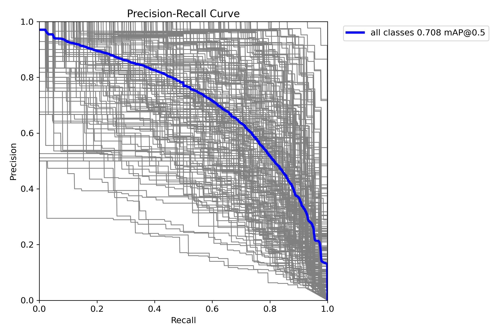

# Dataset
Stanford Car Model Detection Dataset 
https://www.kaggle.com/datasets/jutrera/stanford-car-dataset-by-classes-folder
 
There are total 196 classes in the dataset. The number of training dataset is 8144 and testing dataset is 8041.
The dataset and annotation is converted to YOLOv8 .txt format using [convertion script](convertion.py).

# Training and Evaluation
The dataset is trained with model YOLOv8. I have used the Google Colab for free resources GPU training. The training details can be found in the [notebook](Car_Detection.ipynb).
Since there are quite many classes in this dataset, I have applied data augmentation to increase the number of sample and reduce the overfitting. As result, I get mAP = 0.703 at IoU = 0.5 using epoch = 50. 
Based on the training history, I found that the training still has space to growth by increasing the epoch to yield better result. 

# Model Deploy
The model is deployed using Streamlit cloud due to its efficiency for lightweight project. The main code can be found in [app.py](app.py).  
Link for deployed project  
https://car-model-detection-xgllxsz2th5l95wvmrg5hy.streamlit.app/

# Main package for model deployment
1. ultralytics
2. streamlit
3. pillow
4. opencv-python
5. numpy

